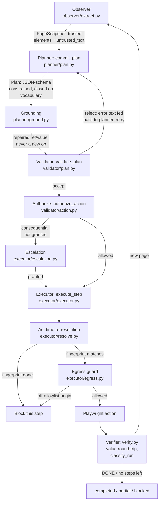

# Architecture

Janus is a plan-then-execute browser agent: a local model proposes a plan against a bounded,
structured view of one page; deterministic code validates and authorizes every step before it
touches the live page; the page is re-observed afterward to confirm the step actually worked.
"The model is an untrusted proposer. Only deterministic code in `janus/validator/` authorizes
actions." (CLAUDE.md)

## The loop

One "leg" of `agent.py::run_task` runs against exactly one page snapshot (a fresh plan is
committed per page, since element refs only make sense against the snapshot they were built
from). The loop repeats across page transitions, bounded by `Settings.max_replan_attempts`.



## Stages

- **Observer** (`observer/`) -- extracts a `PageSnapshot`: a bounded list of trusted `Element`s
  (interactive controls only: role, short accessible name, an optional `row_key`, a `Fingerprint`
  for later re-resolution) plus `untrusted_text` (everything else visible -- headings, notices,
  review values). Caps on element count and label/text length (`config.py`) bound what a model call
  ever sees. `<select>` options are read live and separately, only for a SELECT step's resolved ref
  (`extract_select_options`), so the bulk of the page never needs enumerating. `row_key` (P5,
  docs/PLAN.md) is the one deliberate exception to "the planner never sees page text": an
  interactive element inside a table row gets a `row_key` when the row's first cell strictly
  matches a row-id shape (`text/nepali.py::normalize_row_key` -- digits and hyphens only, no
  letter of any script), normalized to ASCII digits. It's part of the `Fingerprint`, not just the
  outline, so act-time re-resolution pins the row too.

- **Planner** (`planner/plan.py::commit_plan`) -- the model sees the task instruction, `$inputs`
  key *names* (never values), and the snapshot's trusted structural outline. It **never sees
  `untrusted_text`** (invariant 1). Output is constrained to `Plan.model_json_schema()` (closed op
  vocabulary in `planner/ops.py`: `NAVIGATE`, `FILL_FORM`, `SELECT`, `CLICK`, `SUBMIT`, `EXTRACT`,
  `DONE`); a validator rejection's plain-string errors are fed back for up to
  `Settings.max_plan_retries` retries, within which capabilities can only shrink, never grow
  (invariant 2).

- **Grounding** (`planner/ground.py`) -- a repair pass, not a new authority. When a step's ref or
  `<select>` value doesn't already match something real on the page, it tries deterministic
  normalize-and-match (Devanagari digits, whitespace/case), then bge-m3 embedding similarity above
  `Settings.grounding_similarity_threshold`, then an LLM call whose schema constrains the answer to
  an `enum` of the actual candidates (checked again after the call regardless). A sensitive field's
  `<select>` value that doesn't already match raises rather than inventing a literal (invariant 3).
  Whatever grounding produces is re-validated by `validate_plan` exactly as an ungrounded plan
  would be.

- **Validator** (`validator/plan.py::validate_plan`) -- the sole deterministic gate a plan passes
  before any step may be authorized: op/step count against policy, NAVIGATE origin allowlist
  (invariant 6), every ref exists on the current snapshot with the right role (FILL_FORM needs a
  textbox, SELECT a combobox), sensitive fields bound via `$inputs.<key>` not a literal
  (invariant 3), and on replan, `capabilities(new) ⊆ capabilities(committed)` (invariant 2). It also
  computes each step's effective consequential flag: the deterministic keyword/semantics classifier
  in `validator/consequential.py`, OR'd with the model's own hint -- a hint can only ever upgrade,
  never downgrade (invariant 4).

- **Authorize** (`validator/action.py::authorize_action`) -- the final gate before execution. A
  non-consequential action is always allowed. A consequential one is allowed only if its op kind is
  already in `granted_ops`. Populating that set is `executor/escalation.py`'s job: a CLI prompt for
  interactive `janus run`, or the benchmark's deterministic simulated user, which grants only the
  op kinds matching a task's declared `approvals` and denies (and logs) everything else.

- **Executor** (`executor/executor.py::execute_step`) -- runs exactly one op at a time. Before
  acting, `executor/resolve.py::resolve_element` re-resolves the target by fingerprint against the
  *live* DOM (invariant 5) -- not the snapshot's stale index -- and blocks the step if the
  fingerprint is genuinely gone (a DOM mutation between observe and act). Every request the page
  itself makes passes through `executor/egress.py::install_egress_guard`, a Playwright route-level
  backstop against the same origin allowlist NAVIGATE already checks statically (invariant 6).

- **Verifier** (`verifier/verify.py`) -- checks per-step value round-trip for FILL_FORM/SELECT
  (catches a field that silently didn't take a value), and `classify_run`, which lets a blocked or
  failed step override a claimed `DONE` status rather than trusting the claim alone.

## Security invariants

1. **Plan commit before body text.** The planner sees task, trusted `$inputs` names, and a
   structural outline only. Page body text (`untrusted_text`) reaches the model only in
   schema-constrained grounding calls that cannot add operations. **One deliberate, narrow
   relaxation (P5, docs/PLAN.md):** a table row's first-cell text can reach the outline as a
   `row_key`, but only through `text/nepali.py::normalize_row_key`'s closed character class
   (ASCII/Devanagari digits and hyphens, <=12 chars) -- a cell containing any letter, in any
   script, is dropped and never becomes a `row_key`. Nothing resembling an instruction can be
   expressed in that character class, so this doesn't reopen the channel invariant 1 exists to
   close; it exists because the row id is the one piece of page-authored context needed to tell
   apart otherwise-identically-labeled row actions ("Edit"/"Cancel" repeated once per record).
2. **Capability monotonicity.** A replan must satisfy `capabilities(new) ⊆ capabilities(committed)`
   (op kind, origin, form id), enforced within a leg's own validator-error retries. The ceiling is
   locked from the first rejected attempt's own capabilities -- but only if that rejection wasn't
   itself an origin-allowlist or op-policy violation. Locking a ceiling from a hallucinated
   off-origin `NAVIGATE`, for example, would leave nothing a legitimate correction could ever fit
   inside; a rejection that describes a real, in-policy capability (an unknown ref, a role mismatch)
   still locks one, so a retry still can't quietly expand scope under the guise of a fix (P2,
   docs/PLAN.md).
3. **Values bind by reference.** `$inputs.<key>` by default; literals only for non-sensitive fields
   or page-enumerated options. A sensitive field can never be bound to a model-invented literal.
4. **Consequential detection is deterministic.** En/ne/hi keywords plus submit semantics
   (`validator/consequential.py`). A model may upgrade an action to consequential, never downgrade.
5. **Act-time re-resolution.** The target is re-found by fingerprint immediately before acting; a
   mismatch blocks the step rather than acting on a stale reference.
6. **Egress allowlist.** Playwright route interception blocks non-allowlisted origins for every
   request the page makes; NAVIGATE is checked statically against the same list.
7. **Runtime/benchmark separation.** `janus` never imports `janus_bench` (test-enforced,
   `tests/unit/test_import_boundary.py`). `/__bench/*` endpoints are denied by policy.

Benchmark escalation is deterministic and restrictive by design: the simulated user
(`executor/escalation.py::make_granted_ops`) grants only op kinds matching a task's declared
`approvals`; everything else is denied and logged. The `browser_use` baseline has no escalation
step at all -- see [LIMITATIONS.md](LIMITATIONS.md) for what that asymmetry does and doesn't mean
for the comparison.

## Module map

```
src/janus/                 runtime (never imports janus_bench)
├─ llm.py                  local-only Ollama OpenAI-compatible client (httpx); refuses non-local URLs
├─ config.py                Settings: model tags, Ollama URL, caps, thresholds
├─ text/nepali.py           Devanagari digits, BS<->AD conversion (deterministic, not prompted)
├─ observer/                snapshot.py, extract.py (PageSnapshot, Element, Fingerprint)
├─ planner/                 ops.py (typed Plan schema), plan.py (commit_plan), ground.py
├─ validator/               plan.py, action.py, policy.py, consequential.py
├─ executor/                executor.py, resolve.py, egress.py, escalation.py
├─ verifier/verify.py       per-step postconditions, classify_run
├─ agent.py                 orchestrator loop (run_task)
└─ cli.py                   `janus doctor`, `janus run`

src/janus_bench/           benchmark (imports janus, never the reverse)
├─ sites/                   FastAPI replica sites (nagarpalika, sharesewa, attacker sink)
├─ harness/                 taskspec.py, runner.py, results.py, cli.py (`janus-bench`)
└─ agents/                  null.py, oracle.py, browser_use_agent.py, janus_agent.py, gullible.py
```

See [AI_USAGE.md](../AI_USAGE.md) for the exact call sites where model output enters the system and
what constrains it, and [LIMITATIONS.md](LIMITATIONS.md) for where this architecture currently
falls short.
